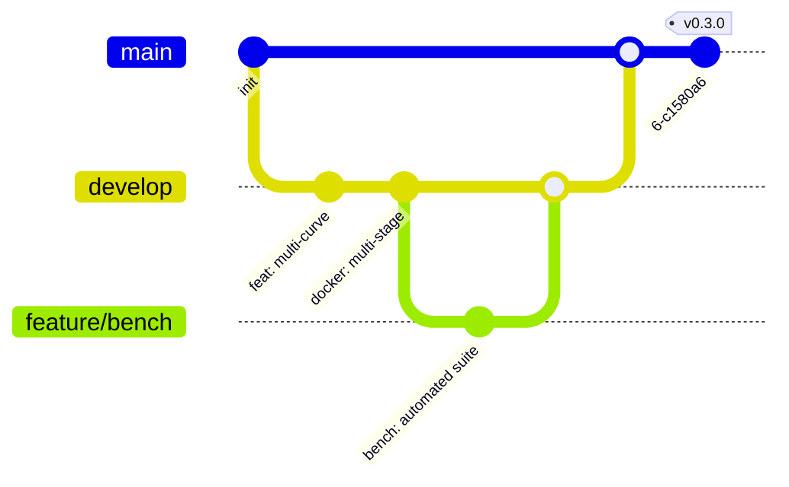

# Architecture Deep Dive

## Codebase Overview

```
cuda-poseidon/
├── poseidon_cuda.cu          # CUDA kernel + host logic
├── poseidon_cuda.h           # Public C API header
├── poseidon_py.py            # Python bindings (ctypes)
├── test_poseidon.c           # C test suite
│
├── bench/
│   └── bench.py              # Automated benchmark suite
│
├── docs/                     # MkDocs documentation source
│   ├── index.md
│   ├── quickstart.md
│   ├── guide/
│   ├── api/
│   └── advanced/
│
├── scripts/                  # Build/release helpers
│   ├── build_all.sh          # Multi-arch build
│   └── release.sh            # Tag + release automation
│
├── .github/
│   └── workflows/
│       ├── build.yml         # CI: compile + test
│       ├── docs.yml          # Docs: deploy to GitHub Pages
│       ├── benchmark.yml     # Bench: run + publish results
│       └── docker.yml        # Docker: build + push to GHCR
│
├── Dockerfile                # Multi-stage CUDA build
├── docker-compose.yml        # Dev convenience
├── .dockerignore             # Docker build exclusions
└── mkdocs.yml                # Docs site config
```

## Kernel Architecture

### Poseidon Hash — One Round

```
    s0  ──▶  [S-box: x⁷]  ──▶  s0'  ────────────────────┐
                                                           ├──▶  s0_out = s0' + s1' + RC
    s1  ──▶  [S-box: x⁷]  ──▶  s1'  ──┬─────────────────┤
                                       │                  │
                                       └──────────────── ├──▶  s1_out = s0' + s1'
                                                          │
    RC (round constant) ───────────────────────────────── ┘
```

### Merkle Tree Level

```
Level k:       [L0] [L1] [L2] [L3] [L4] [L5] ... [L2k+1]
                  └──H┘    └──H┘    └──H┘           │
Level k-1:        [N0]      [N1]      [N2]     ... │
                     └────H──┘          └────H────  ┘
Level k-2:             [M0]                 [M1]    ...
                       ...                    ...
                                         └──▶  ROOT
```

Each level halves the number of nodes. Merkle tree height = log₂(N leaves).

## Host-Device Interaction

```
┌─────────────────────────────────────────────────────────┐
│                      Host (CPU)                         │
│                                                         │
│  poseidon_init()                                        │
│      ├── cudaGetDeviceCount()                           │
│      └── cudaMemcpyToSymbol(POSEIDON_RC, h_rc, ...)     │
│                                                         │
│  poseidon_hash_batch(input, output, N, rounds)          │
│      ├── cudaMalloc(&d_in, ...)                         │
│      ├── cudaMemcpy(d_in, input, ..., H2D)              │
│      ├── kernel<<<blocks, threads>>>(d_in, d_out, ...)  │
│      ├── cudaMemcpy(output, d_out, ..., D2H)            │
│      ├── cudaFree(d_in)                                 │
│      └── cudaFree(d_out)                                │
│                                                         │
│  merkle_build_gpu(leaves, N, root)                      │
│      ├── ensure_capacity(N)  →  cudaMalloc buffers      │
│      ├── Copy leaves to GPU                             │
│      └── Loop: pairs=N; while pairs>1; pairs/=2         │
│          ├── kernel<<<blocks, threads>>>(src, dst, ...) │
│          └── swap(src, dst)                             │
└─────────────────────────────────────────────────────────┘
```

## Git Workflow



## Version Strategy

- **Patch** (`0.0.X`): Bug fixes, docs updates, benchmark adjustments
- **Minor** (`0.X.0`): New features (multi-curve, new API, etc.)
- **Major** (`X.0.0`): Breaking changes to core API
